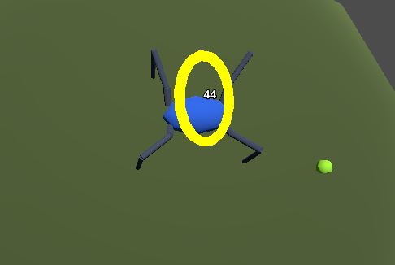
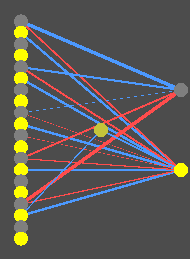

I have implemented the ability to click a spider and see his brain.

## Clicking on something with no collider

At first, I was met with an issue, how could one click on something with no collider? The spiders do not have any colliders, so the default approach wouldn't work here. Due to that, I opted for another solution, which basically consisted of checking which spider was closest to where the click happened, and all I can say is that it works, at least for now. With that I also added an indicator to show which spider we are looking at.



<details>
<summary><strong>For the code-curious</strong> - click to expand</summary>

Since spiders have no colliders, selection works by projecting a ray from the click point and finding whichever spider sits closest to that ray, not by hitting a collision shape.

```csharp
Vector3 rayOrigin = Camera.ProjectRayOrigin(mousePos);
Vector3 rayDir = Camera.ProjectRayNormal(mousePos);

SpiderMovement best = null;
float bestDist = float.MaxValue;

foreach (var s in Spawner.ActiveSpiders)
{
    Vector3 toSpider = s.GlobalPosition - rayOrigin;
    float t = toSpider.Dot(rayDir);
    if (t < 0f) continue;

    Vector3 closestPoint = rayOrigin + rayDir * t;
    float dist = closestPoint.DistanceTo(s.GlobalPosition);

    if (dist < bestDist)
    {
        bestDist = dist;
        best = s;
    }
}
```

</details>

<span class="margin-note">I thought to myself that it can't be that simple, but there I was, completely astounded that my solution was actually working!</span>

## Watching a brain think

The brain view now shows input, output and hiden nodes, and while they are not described by any means, it serves as a nice baseline and has potential for a future editor. Active nodes are lighting up, thickness represents weight, and the color serves as a distinction between a positive and a negative value.



<details>
<summary><strong>For the code-curious</strong> - click to expand</summary>

Each node's color comes straight from its last activation value, remapped from roughly -1..1 into a blue-to-red gradient.

```csharp
float activation = genome.LastActivations.TryGetValue(node.Id, out float v) ? v : 0f;
float t = Mathf.Clamp((activation + 1f) / 2f, 0f, 1f);
Color col = new Color(t, t, 1f - t);

DrawCircle(positions[node.Id], 7f, col);
```

</details>

I still have some issues with comprehending the brains of the spiders. Just looking at nodes lighting up doesn't convince me that this is everything that makes the spiders move, seek food or mate with eachother, yet I need to accept it as a fact.

## Also recently

There had been some minor changes too recently, mainly, spiders now use a cone to seek out a mate, meaning it isn't by proximity now. The second change was a small fix to the color inheritance, after a few generations, spiders legs started going to a muddy brown color, which killed diversity between them, and while the color is just a cosmetic thing, I still felt like that was an urgent fix that couldn't wait.

## What's next

While I don't have a perfect roadmap in my head, I'm thinking about closing off this 'V1' version by adding a saving system and updating the graphics. I feel that with those functions and improvements I could happily say that I made something that works, which would then serve as a baseline for new updates and enhancements, and not be a work in progress project.