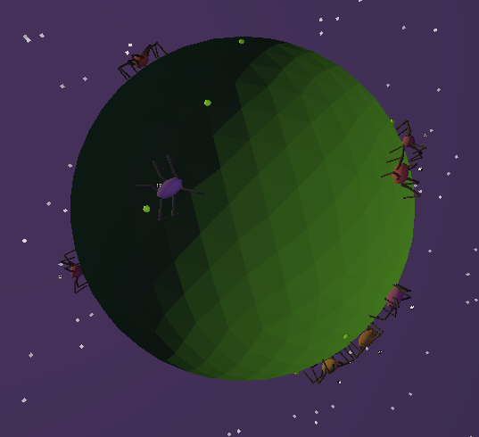

I can now, wholeheartedly say, that I made something and it just works! Spiders are janky, the world around them not much different, but it works nonetheless and that's what matters to me the most. I haven't precisely put down what I want the sim to include, it's still in a playground phase where I'm trying things and seeing what actually works, but I also feel comfortable enough to say that what I have here is the first version of something I have envisioned.

## Being able to keep one

It took me some time, but I managed to make the saving system work. For now it's just a simple concept, you select a spider, you press the 'Save' button, and it's in the memory, now once you press the 'Load' button the saved spider appears somewhere on the planet, and that's basically it. Despite it being so simple I feel like this is a great first step towards a proper world saving system or a species editor. Until then it's use is rather limited, but it allows you to repopulate the whole planet with a spider you adore most.

<details>
<summary><strong>For the code-curious</strong> - click to expand</summary>

```csharp
public static void SaveSpider(BodyGenome body, NeatGenome brain, string filename)
{
    var root = new Godot.Collections.Dictionary();
    root["body"] = body.ToDict();
    root["brain"] = brain.ToDict();

    string json = Json.Stringify(root, "\t");
    string path = $"user://{filename}.json";

    using var file = FileAccess.Open(path, FileAccess.ModeFlags.Write);
    file.StoreString(json);
}

public static (BodyGenome body, NeatGenome brain) LoadSpider(string filename)
{
    string path = $"user://{filename}.json";
    if (!FileAccess.FileExists(path))
        return (null, null);

    using var file = FileAccess.Open(path, FileAccess.ModeFlags.Read);
    string json = file.GetAsText();

    var parsed = (Godot.Collections.Dictionary)Json.ParseString(json);
    var body = BodyGenome.FromDict((Godot.Collections.Dictionary)parsed["body"]);
    var brain = NeatGenome.FromDict((Godot.Collections.Dictionary)parsed["brain"]);

    return (body, brain);
}
```

</details>

<span class="margin-note">Now I can have my army of clones take over entire planets!</span>

## The part I'd been avoiding

It took me a while to get back to graphics, but it had to be done for this part to feel complete. There were times I simply hated looking at the bleak gray background, or the smooth looking ground, but I also knew that the graphics won't allow me to advance the project in a meaningful way. With the recent additions I finally decided it's time to do something about it, partially because I was happy with where I got systems wise, and partially because the whole scene kept making me more and more disgusted.

## From quads to an icosphere (and a nice backdrop)

When I started playing around with the lighting I've noticed something that didn't sit right with me, mainly that the planet was divided into rectangles and not triangles. It took some more playing around, but I managed to make the planet look how i envisioned it by using a custom generated icosphere with a shader on top, and that change alone made everything look 10x better in my eyes. With that, I also finally added a proper background, though it's nothing fancy, just a simple purple-ish sky with some dots representing stars, it looks way better than the previous gray placeholder background.



<details>
<summary><strong>For the code-curious</strong> - click to expand</summary>

The whole idea is computing one flat normal per a triangle face, instead of using the smoother per-vertex normals a mesh usually ships with, that's what actually produces the hard, faceted look rather than a soft and rounded one.

```glsl
void fragment() {
    vec3 dx = dFdx(world_pos);
    vec3 dy = dFdy(world_pos);
    vec3 flat_normal = normalize(cross(dx, dy));
    NORMAL = normalize((VIEW_MATRIX * vec4(flat_normal, 0.0)).xyz);

    ALBEDO = albedo_color.rgb;
}
```

</details>

## The lighting saga

First culprit was the main light, the cutoff point on the surface of the planet was too pronounced for my liking, it looked to me like a perimiter that sliced the planet in half, though the fix was rather easy, I added a second complimentary light on the opposite side of the planet to disperse the light a bit more and make the cutoff less strong. Then the next problem arrived, (un)surprisingly lighting up a flat plane and a sphere in space are two different things, and with that, the shadows have gotten absolutely janky, some spiders were lit from their belly and had their backs dark, others were lit on the side, absolute chaos. I've tried playing with shadows, then I turned to the lights itself, none of which brought a needed fix, but then a new idea popped into my head, and I decided to take a step back. The solution for now is a spotlight attached to the camera, Lighting anything that the camera is looking at, making every spider (or food pellet) be lit in an apropriate way, no matter where on the planet it resided. It took some playing around, but that's some good knowledge for the future, and I managed to land on something that works for now which is a win-win in my books.

<span class="margin-note">All i can say is that i was getting more and more annoyed, if not angry, with each pass like: WHY. IS. IT. NOT. WORKING.</span>

## Two small bugs, fixed along the way

Since i was on the topic on making the sim more pleasant to play with, I also tackled some issues that were persistent, which I didn't find annoying enough to tackle up to this point. Both of them were regarding the camera controls, for whatever reason I had the inputs reversed, meaning that when I pressed 'W' the camera went, well, 'down' and vice versa, pitch and yaw both had a '-' sign next to them, yet I never even bothered to fix that. The second issue was that the camera movement was tied to the simulation speed, which caused it to move 4x as fast when you used the 4x speed, and also, which was more annoying, camera didn't move at all when you paused the simulation, so I decided this was the right moment to straighten out all the kinks.

## What "done" actually means here

As I mentioned a few times before in this post, what I have here is nowhere close to a finished simulation, but it is something that makes me proud when I think of it. I made a working system with evolution, reproduction and population control included. I have the option to look inside the spider brains, and while it is very limited at that stage it is still a function that adds to the simulation. On top of that I made some visual enhancements, and all of that combined is what makes me feel like I can call it a proper first version. Is it full of junk, redundency and quick patches that i will need to come back to? Of course all of it is true, but it's my junk at the end of the day, and I'm proud of that. With that said, there are also plenty of things I decided to push further back in development like, combat, day/night cycle or cosmetic enhancements, which are just some things on the list for what I want to add in the future.

## What's next

It's a huge step forwards for me, and I want to keep pushing it towards what I've envisioned, though I know how life can get. I will keep working on the project in the meantime and I'll keep writing updates for this journal/blog. Maybe I will also work on a more clear roadmap for the project, but it's all due for revision, for now though, I'll keep making fixes and coming up with new ideas for the future versions.
