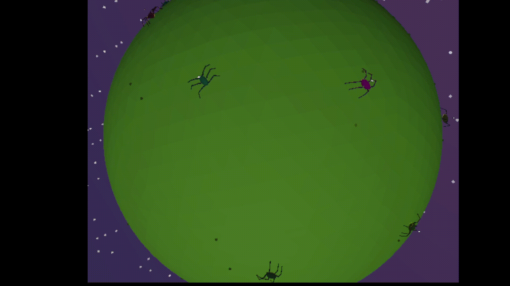

The gait was a big mess ever since I started this project, the whole development process up until now was simply about adding patches on top of patches to make it feel or look alright, and I finally decided I've had enough. I've spent weeks playing with values, adding functions semi blindly, just to seemingly fix the whole walking system, but I took a proper step back one day, and came to a conclusion that this way of approaching things is simply a dead end. With that in my mind, I just scrapped the walking back to the bare bones, simply to redo it at a slower pace, making sure each *step* (heh) is implemented properly.

## Two things were wrong

After I've spent some time revising the code and stripping the unnecessary bits away, I've stumbled across not one, but two issues, neither of which was strictly connected to a tuning bug. The first issue was that I have made two different definitions of 'front' coexist at once, and the second bug was connected to accidentally recalling a formula regarding the stance. Those two were the reason why my spiders seemed 'skewed' and why patching never worked, it couldn't since the issue was completely elsewhere. I tried making water flow faster downstream, when there was a dam upstream all along.

<span class="margin-note">That was a very grotesque image, pure bliss entangled in an ocean of madness and despair, but hey, I can't say I wasn't prepared!</span>

<details>
<summary><strong>For the code-curious</strong> - click to expand</summary>

This single function decides where every leg's hip sits relative to the body. One sign was flipped here, in the Z-axis, and it corrected every leg at once, since this was the shared source every other part of the leg system reads from.

```csharp
public Vector3 GetCoxaOrigin(LegGenome leg)
{
    var segment = Segments[0];
    float t = leg.BodyOffsetT * 2f;
    float halfWidthAtT = segment.RadiusX * Mathf.Sqrt(Mathf.Max(0.01f, 1f - t * t));
    float x = leg.Side * halfWidthAtT;
    float z = -t * segment.RadiusX * segment.LengthScale;
    float y = GroundClearance;
    return new Vector3(x, y, z);
}
```

</details>

## Rebuilding in stages, not all at once

Exactly as I mentioned it before, I stripped the walking systems to its bare bones, starting with static legs that were just poking out of the body, confirming the positions and angles are right before moving to adding stepping and other additions. I put in a bunch of effort to make sure the foundations of walking are as crisp as I could, I wanted it to be a proper rework this time around and not some new patch that seemingly made everything look alright. I wanted this to end in a system I could trust and build upon, not one which I would need to make patches for every time I decided to add or remove something.



<details>
<summary><strong>For the code-curious</strong> - click to expand</summary>

`neutralTarget` is where a leg rests when nothing is impacting its position, it's calculated once and never touched by movement. Everything bias-related happens right after that, only once a step actually triggers, landing the foot slightly ahead of or behind that neutral point depending on which way the spider is actually moving. That separation is the whole fix, the two were entangled together before, causing all the mess.

```csharp
private void UpdateStep(LegRuntime leg, float dt, Vector3 hipVelocity)
{
    if (leg.IsStepping)
    {
        AdvanceStep(leg, dt);
        return;
    }

    Vector3 neutralTarget = GetRestTarget(leg.Data);
    float reach = leg.Data.FemurLength + leg.Data.TibiaLength;
    float threshold = reach * StepThresholdFraction;

    if (leg.CurrentFootPos.DistanceTo(neutralTarget) <= threshold)
        return;

    float speed = hipVelocity.Length();
    Vector3 biasDir = speed > 0.01f ? hipVelocity / speed : Vector3.Zero;

    float cap;
    if (speed <= 0.01f)
    {
        cap = (PrimaryStrideBiasFraction + OppositeStrideBiasFraction) * 0.5f;
    }
    else
    {
        Vector3 spiderForward = -GlobalTransform.Basis.Z;
        float alignment = biasDir.Dot(spiderForward);
        float t = (Mathf.Clamp(alignment, -1f, 1f) + 1f) * 0.5f;
        cap = Mathf.Lerp(OppositeStrideBiasFraction, PrimaryStrideBiasFraction, t);
    }

    float biasAmount = Mathf.Min(speed * StrideBiasSpeedScale, reach * cap);
    Vector3 landingPoint = neutralTarget + biasDir * biasAmount;
    Vector3 finalTarget = PlanetCenter + (landingPoint - PlanetCenter).Normalized() * PlanetRadius;

    StartStep(leg, finalTarget);
}
```

</details>

That was the moment I could actually say that I made something that's working, and it's working properly at that. The math finally agreed with me, and more importantly with itself, front legs actually reached ahead, rear legs did the same but in reverse, and neither of them needed its own special case scenario, it simply clicked into it's place. It finally felt like I had a proper piece of code put down, a piece that wasn't coincidentally working, but working as I intended from the get go.

## What this taught me

Since I'm still early in my dev career, I feel like this was a crucial lesson, actually seeing and feeling that some things just not work, and you can seemingly 'lose' weeks worth of progress, but in reality it was a whole adventure to get to this point, and each let down or mistake put me closer to reaching the destination.

## What's next

I am happy with how the legs are at this point, and above all I feel like I can trust them now, and with that, I feel ready to properly start off v2, so in the near future you could expect a post regarding pheromones or at least something along those lines.